# App Store Submission Document

> **Preview tip:** Open preview with **Cmd+Shift+V** (or *Markdown: Open Preview to the Side*). Images live in `docs/screenshots/`. Cursor’s built-in editor Preview toggle often fails to render local images — use the classic Markdown preview instead.

**Project:** Submit an iOS App to the Udacity App Store  
**App:** OtterlyFit (Xcode target / product: FitCard)  
**Prepared for:** App Store Connect product page + review readiness (documentation only — not an actual Apple submission)

This document fills the Udacity `app-store-submission-document.docx` template 1:1, then adds release-build notes, privacy detail, and a screenshot plan.

---

## App Store Submission Required Information


| Field                | Your Answers                                                    |
| -------------------- | --------------------------------------------------------------- |
| **Platforms**        | iOS (iPhone and iPad). Minimum deployment target: **iOS 17.0**. |
| **App Name**         | OtterlyFit                                                      |
| **Primary Language** | English (U.S.)                                                  |
| **Bundle ID**        | `com.otterlyfit.workout`                                        |
| **SKU**              | `otterlyfit-ios-001`                                            |
| **User Access**      | Full Access (not limited to App Store Connect users only)       |
| **Primary Category** | Health & Fitness                                                |
| **Secondary Category** | Lifestyle                                                     |


---


## iOS App Previews and Screenshots

Screenshots must be JPG or PNG, RGB color space. This package mixes **physical iPhone** captures (preferred for product-page marketing — more realistic status bar / device chrome) with **iPhone 17 Pro Simulator** shots where no device equivalent was provided (Workout Player, Scan Card, Routines list). For App Store Connect upload, re-export at the required native sizes (1290×2796, 1284×2778 / 1242×2688, 1242×2208) if Connect rejects scaled PNGs.

**Source folder:** `docs/screenshots/`

**Naming**

| Prefix | Meaning |
| ------ | ------- |
| `01-`…`07-` | **Primary App Store Connect upload** filenames (same content as the preferred `device-` / `sim-` source) |
| `device-` | Physical iPhone captures |
| `sim-` | iPhone 17 Pro Simulator archive / extras |

### Recommended App Store product screenshot order (marketing)

Upload in this order on the product page (Home first). Slots 1–6 are the primary Connect uploads. Prefer **device** for Home, Exercises, Routine Detail, and History; keep **simulator** for Workout Player and Scan Card until device equivalents exist.

| Order | Primary upload | Source file | Screen | Source |
| ----- | -------------- | ----------- | ------ | ------ |
| 1 | [`01-home.png`](./screenshots/01-home.png) | [`device-01-home.png`](./screenshots/device-01-home.png) | **Home** — OtterlyFit branding hero with tab bar | Physical iPhone |
| 2 | [`02-exercises.png`](./screenshots/02-exercises.png) | [`device-02-exercises.png`](./screenshots/device-02-exercises.png) | **Exercise Library** — seeded exercises with card images | Physical iPhone |
| — | *(extra)* | [`device-03-exercise-detail.png`](./screenshots/device-03-exercise-detail.png) | **Exercise detail** — High Plank Leg Lift with Band card image | Physical iPhone |
| — | *(extra)* | [`03-routines.png`](./screenshots/03-routines.png) / [`sim-03-routines.png`](./screenshots/sim-03-routines.png) | **Routines list** — optional; not a required Connect slot | iPhone 17 Pro Simulator |
| 3 | [`04-routine-detail.png`](./screenshots/04-routine-detail.png) | [`device-05-routine-detail.png`](./screenshots/device-05-routine-detail.png) | **Routine detail** — Morning Strength (Push-Up / Squat / Plank), Start Workout | Physical iPhone |
| — | *(extra / HIG)* | [`device-04-edit-exercise.png`](./screenshots/device-04-edit-exercise.png) | **Edit Exercise** — form customization (High Plank Leg Lift with Band) | Physical iPhone |
| 4 | [`05-workout-player.png`](./screenshots/05-workout-player.png) | [`sim-05-workout-player.png`](./screenshots/sim-05-workout-player.png) | **Workout Player** — active set (Goblet Squat), progress, controls | iPhone 17 Pro Simulator |
| 5 | [`06-scan-card.png`](./screenshots/06-scan-card.png) | [`sim-06-scan-card.png`](./screenshots/sim-06-scan-card.png) | **Card Scanner** — scan-with-camera / import-from-photos intro | iPhone 17 Pro Simulator |
| 6 | [`07-history.png`](./screenshots/07-history.png) | [`device-06-history.png`](./screenshots/device-06-history.png) | **History / Statistics** — completed workouts (Complete status) | Physical iPhone |

### Screenshot 1 — Home (iPhone 6.7" slot) — PRIMARY · Physical iPhone

**File:** `docs/screenshots/01-home.png` (= `device-01-home.png`)  
**What it shows:** OtterlyFit branding hero with tab bar visible (Home / Exercises / Routines / History / Scan Card).  
**Replaces:** earlier simulator `sim-01-home.png` for marketing upload.

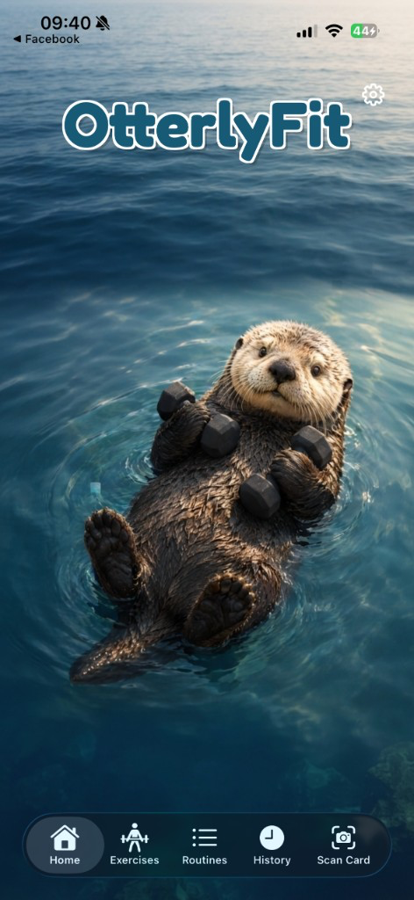

### Screenshot 2 — Exercise Library (iPhone 6.7" slot) — PRIMARY · Physical iPhone

**File:** `docs/screenshots/02-exercises.png` (= `device-02-exercises.png`)  
**What it shows:** List of seeded exercises with card images.  
**Replaces:** earlier simulator `sim-02-exercises.png` for marketing upload.

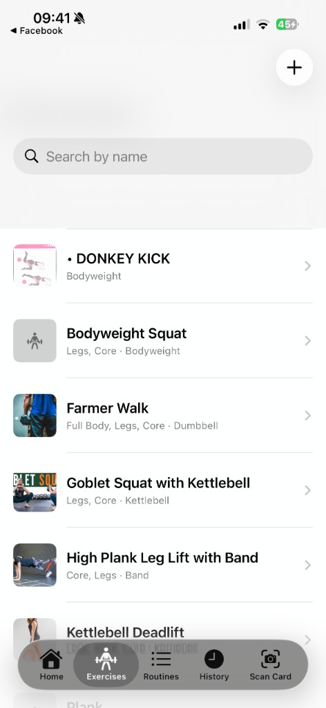

### Extra — Exercise detail (Physical iPhone)

**File:** `docs/screenshots/device-03-exercise-detail.png`  
**Role:** Optional marketing / review extra (not a numbered Connect primary). Shows a full exercise card image (High Plank Leg Lift with Band).

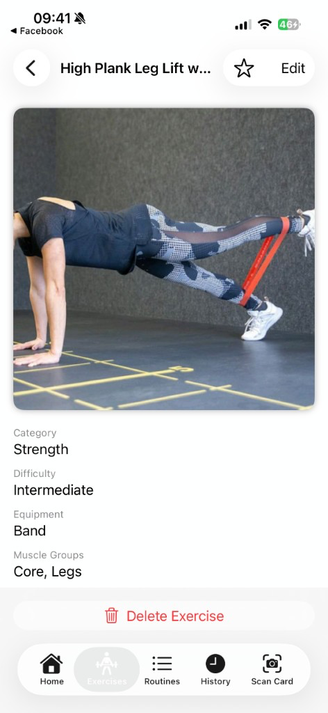

### Optional — Routines list (Simulator)

**File:** `docs/screenshots/03-routines.png` (= `sim-03-routines.png`)  
**What it shows:** Routines tab listing saved routines. Useful as an extra; App Store Connect slot 3 uses routine detail below.

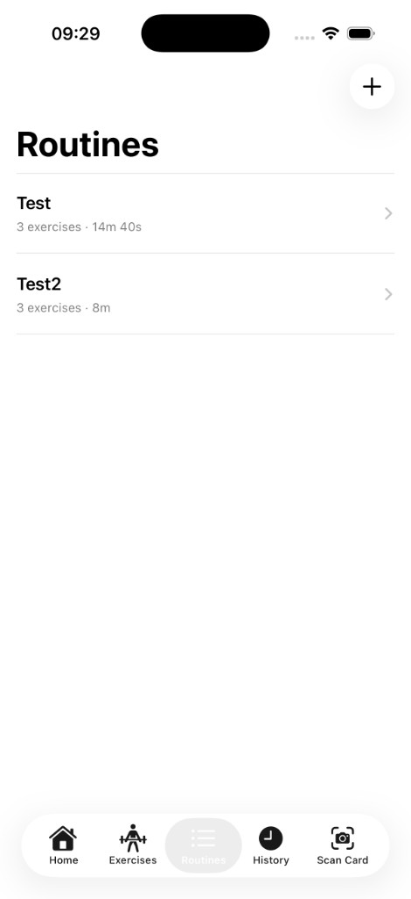

### Screenshot 3 — Routine detail / builder (iPhone 6.5" slot) — PRIMARY · Physical iPhone

**File:** `docs/screenshots/04-routine-detail.png` (= `device-05-routine-detail.png`)  
**What it shows:** Routine **Morning Strength** with Push-Up / Squat / Plank blocks, sets/reps/rest, and **Start Workout**.  
**Replaces:** earlier simulator Test2 shot (`sim-04-routine-detail.png`) for marketing upload.

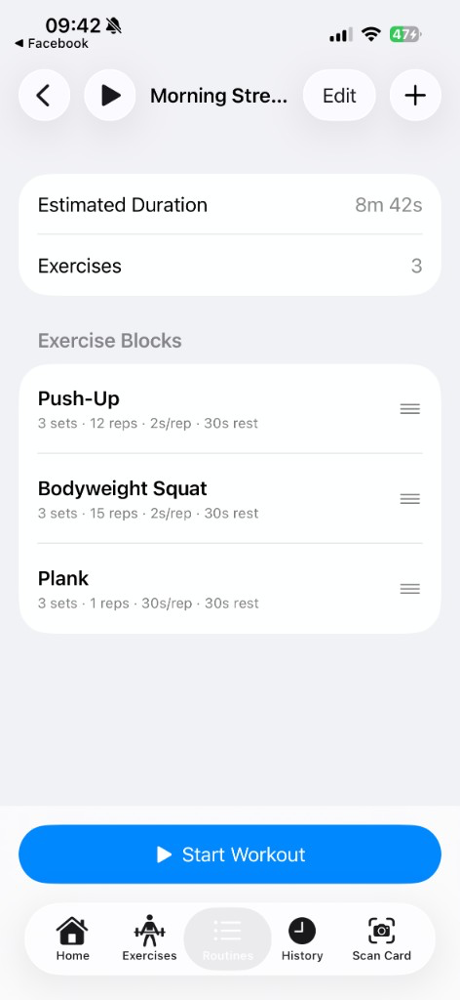

### Extra — Edit Exercise (Physical iPhone · HIG / customization)

**File:** `docs/screenshots/device-04-edit-exercise.png`  
**Role:** Illustrates exercise customization / form UI (HIG). Not a numbered Connect primary unless you want a seventh marketing asset.

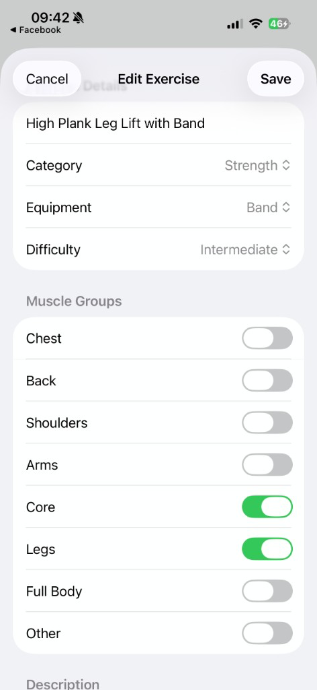

### Screenshot 4 — Workout Player (iPhone 6.5" slot) — PRIMARY · Simulator

**File:** `docs/screenshots/05-workout-player.png` (= `sim-05-workout-player.png`)  
**What it shows:** Active set with exercise card image (Goblet Squat), progress ring / timer, and controls.  
**Note:** No physical-device equivalent in this package — keep simulator until re-captured on device.

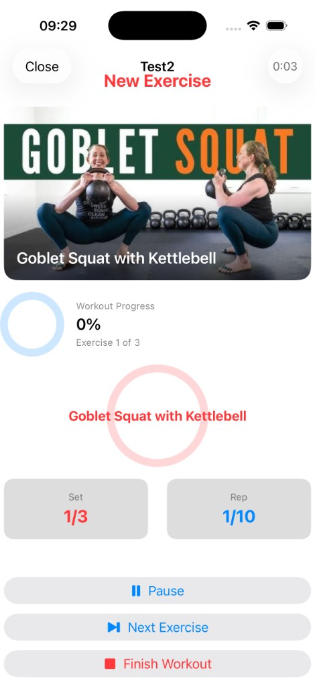

### Screenshot 5 — Card Scanner (iPhone 5.5" slot) — PRIMARY · Simulator

**File:** `docs/screenshots/06-scan-card.png` (= `sim-06-scan-card.png`)  
**What it shows:** Scan Card intro (scan with camera / import from photos). Does not show private photo library contents.  
**Note:** No physical-device equivalent in this package — keep simulator until re-captured on device.

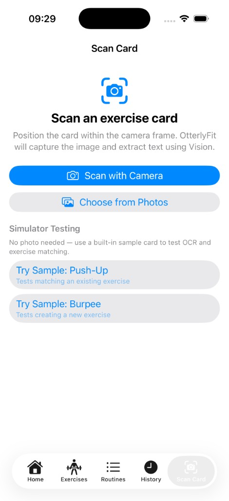

### Screenshot 6 — History / Statistics (iPhone 5.5" slot) — PRIMARY · Physical iPhone

**File:** `docs/screenshots/07-history.png` (= `device-06-history.png`)  
**What it shows:** Workout history with **Complete** status (better marketing data than earlier Partial / test rows).  
**Replaces:** earlier simulator `sim-07-history.png` for marketing upload.

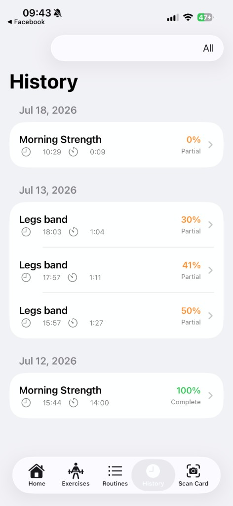

### Simulator archive (superseded primaries)

Kept for comparison / fallback; **do not** prefer these over device shots for Connect slots 1–3 and 6:

| Archive file | Was primary for |
| ------------ | --------------- |
| [`sim-01-home.png`](./screenshots/sim-01-home.png) | Home |
| [`sim-02-exercises.png`](./screenshots/sim-02-exercises.png) | Exercises |
| [`sim-04-routine-detail.png`](./screenshots/sim-04-routine-detail.png) | Routine detail (Test2) |
| [`sim-07-history.png`](./screenshots/sim-07-history.png) | History (weaker / Partial test data) |

**Optional App Preview (video):** 15–30s clip: Scan Card → confirm exercise → open Routine → start Workout Player with voice cue → finish → History.

**Capture tips**

- Prefer light/default appearance unless the UI is intentionally dark.
- Prefer **physical device** shots for product-page marketing when available; Simulator is fine for docs extras and slots without a device capture.
- Hide the iOS status bar clock/carrier if your capture tool supports clean status bars.
- Use seeded default exercises (shipped in Release) so screenshots look populated without Debug sample workouts.
- Devices used for this package: **Physical iPhone** (device shots, 2026-07-21) and **iPhone 17 Pro Simulator** (sim shots, 2026-07-20).

---


## Product Page Copy


### Subtitle

Scan cards, train offline

*(Max 30 characters. Shown under the app name on the product page.)*

### Promotional Text

Scan fitness cards, build routines, and train with voice-guided workouts — all offline on your iPhone.

*(Max 170 characters. Update anytime without a new binary.)*

### Description

OtterlyFit turns physical fitness cards into a personal, offline workout coach.

**Scan your cards**  
Use the camera or photo library to capture exercise cards. On-device Vision OCR reads the card so you can confirm details and add exercises to your library.

**Build your library**  
Browse and edit exercises with muscle groups, equipment, difficulty, and card images. A starter set of exercises is included so you can train immediately.

**Create reusable routines**  
Compose ordered workout routines with sets, reps, weight, rest between sets, and rest between exercises. Reorder blocks and tweak each exercise to match your plan.

**Train with a guided player**  
Play routines with timers, progress feedback, and spoken voice prompts for preparation, work, rest, and completion — so you can keep your eyes on the movement.

**Track your history**  
Review completed workouts and statistics over time. Everything is stored locally with SwiftData — no account required.

OtterlyFit is built for people who love tangible workout cards and want a modern playback experience without a backend or subscription.

**Key features**

- Card scan via camera (VisionKit) or photo import
- On-device text recognition (Vision)
- Exercise library with search-friendly organization
- Routine builder with configurable blocks
- Workout player with voice coaching (AVSpeechSynthesizer)
- Workout summary and history
- Offline-first — no login, no cloud required for core use


### Keywords

`fitness,workout,exercise,card,scan,OCR,routine,timer,voice,gym,strength,training,offline,coach,reps`

*(Comma-separated, max 100 characters. Avoid duplicating the app name.)*

### Support URL

`https://www.otterlyfit.example/support`  
*[PLACEHOLDER — replace with a real support page before App Store Connect submission.]*

### Marketing URL (optional)

`https://www.otterlyfit.com`  


### Privacy Policy URL

`https://www.otterlyfit.com/privacy`  


Version

1.0 (Build 1)

### What's New (Version 1.0)

Welcome to OtterlyFit! Scan fitness cards, build routines, and train with voice-guided workouts — all offline.

### Copyright

© 2026 OtterlyFit. All rights reserved.  


### Contact email (App Store Connect / App Review)

`kotehok@gmail.com`  


---


## App Review Information


### Sign in Required

**No.** OtterlyFit does not require a login or password. All core features work without an account.

### Notes (for App Review)

Thank you for reviewing OtterlyFit.

**How to exercise core flows**

1. Open the **Exercises** tab — a starter library of exercises with card images is seeded on first launch (Release builds included).
2. Open **Routines** → create or open a routine → add exercises → configure sets/reps/rest → save.
3. Start a workout from a routine. The **Workout Player** uses on-device text-to-speech voice prompts (no microphone permission; audio output only). Complete or finish early to see **Workout Summary**, then check **History**.
4. **Scan Card** tab: on a physical device, tap **Scan with Camera** and point at a printed/handwritten exercise card, **or** use **Photos** to import a card image. Confirm the recognized exercise and save it to the library. Document camera requires a real device (Simulator has limited camera support).

**Permissions you may see**

- Camera — scan exercise cards  
- Photo Library — import card images

**Not used in this 1.0 binary**

- No user accounts / backend  
- No HealthKit write/read in the shipping code path (`HealthKitService` is a stub reserved for a future phase)  
- No microphone / speech recognition (voice coaching is TTS only)  
- No analytics SDKs or third-party trackers

**Demo account:** N/A

---


## Age Rating Questionnaire (recommended answers)

Likely overall rating: **4+**


| Topic                                            | Answer |
| ------------------------------------------------ | ------ |
| Cartoon or Fantasy Violence                      | None   |
| Realistic Violence                               | None   |
| Prolonged Graphic or Sadistic Realistic Violence | None   |
| Profanity or Crude Humor                         | None   |
| Mature/Suggestive Themes                         | None   |
| Horror/Fear Themes                               | None   |
| Medical/Treatment Information                    | None   |
| Alcohol, Tobacco, or Drug Use or References      | None   |
| Simulated Gambling                               | None   |
| Sexual Content or Nudity                         | None   |
| Graphic Sexual Content and Nudity                | None   |
| Unrestricted Web Access                          | No     |
| Gambling and Contests                            | No     |
| Contests                                         | No     |


Fitness imagery only; no user-generated social feed.

---


## Pricing & Availability


| Field                               | Answer                                                                                   |
| ----------------------------------- | ---------------------------------------------------------------------------------------- |
| **App Availability**                | Available in all territories the developer account supports (or primary: United States). |
| **Price Schedule / Starting Price** | Free                                                                                     |
| **In-App Purchase**                 | None                                                                                     |
| **Subscriptions**                   | None                                                                                     |


---


## Data Collection / Privacy Nutrition Labels


### Template choice

**[No, we do not collect data from this app]**

### Rationale (accuracy for this codebase)

- Persistence is **local SwiftData** on device.
- Card images and OCR run **on device** (Vision / VisionKit); results are stored locally as exercises.
- Voice prompts use **AVSpeechSynthesizer** (speech synthesis / audio playback) — not recording, not sent to a server.
- No accounts, email capture, analytics, advertising, or network API calls were found in the app sources.
- **HealthKit** is planned in design docs but **not active** in 1.0 (stub only). Do **not** declare Health data collection until write/read is implemented and entitlements/usage strings are added.


### If App Store Connect asks for “data used to track” / “linked to user”

- Data Used to Track You: **No**
- Data Linked to You: **None**
- Data Not Linked to You: **None** (nothing leaves the device)


### Permissions vs “collection”

Camera and Photos access are for **App Functionality** on device. On-device processing that never leaves the device is not declared as collected data in App Privacy, provided you do not transmit it.

### Privacy evidence — Photos picker (limited library)

**File:** `docs/screenshots/privacy-photos-picker.png`  
**Not** a primary App Store marketing screenshot. Use for review notes / privacy documentation: system Photos picker showing limited library access when importing a card image.

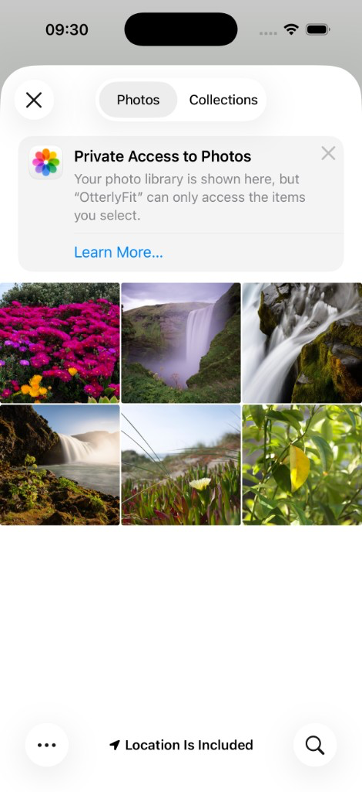

---


## Categories


| Field                  | Answer           |
| ---------------------- | ---------------- |
| **Primary Category**   | Health & Fitness |
| **Secondary Category** | Lifestyle        |


---


## App Icon & Branding


| Item                        | Value                                                                                             |
| --------------------------- | ------------------------------------------------------------------------------------------------- |
| Display name (home screen)  | OtterlyFit                                                                                        |
| Xcode target / product name | FitCard                                                                                           |
| App icon asset              | `FitCard/Resources/Assets.xcassets/AppIcon.appiconset/AppIcon.png` (1024×1024, RGB, **no alpha**) |


---


## Xcode Release Readiness Checklist


### Already good (verified)

- [x] Bundle ID: `com.otterlyfit.workout`
- [x] Display name: OtterlyFit (`INFOPLIST_KEY_CFBundleDisplayName`)
- [x] Marketing version **1.0**, current project version / build **1**
- [x] Deployment target **iOS 17.0**
- [x] App icon present (1024×1024 single-size iOS App Icon)
- [x] Launch screen generated (`INFOPLIST_KEY_UILaunchScreen_Generation = YES`)
- [x] Camera usage description present
- [x] Photo Library usage description present
- [x] App Category: **Health & Fitness** (`LSApplicationCategoryType = public.app-category.healthcare-fitness`; secondary **Lifestyle** in App Store Connect)
- [x] Automatic signing with Development Team set in project
- [x] Debug-only sample workout seed wrapped in `#if DEBUG` (does not insert Preview workouts in Release)
- [x] Default exercise library seeds in Release (helpful for App Review and first-run UX)
- [x] No login wall
- [x] Offline-first architecture (no backend dependency)


### Fixed for this submission package

- [x] Removed **alpha channel** from App Store app icon (Apple rejects icons with transparency)
- [x] Declared **ITSAppUsesNonExemptEncryption = false** (export compliance: standard HTTPS/OS encryption only; no custom non-exempt crypto)
- [x] Restricted **iPhone** supported orientations to **Portrait** (workout UI is portrait-primary; iPad orientations unchanged)


### Privacy keys — intentional omissions


| Key                                                                | Status                                                                                 |
| ------------------------------------------------------------------ | -------------------------------------------------------------------------------------- |
| `NSCameraUsageDescription`                                         | Present                                                                                |
| `NSPhotoLibraryUsageDescription`                                   | Present                                                                                |
| `NSMicrophoneUsageDescription`                                     | **Not required** — TTS playback only                                                   |
| `NSSpeechRecognitionUsageDescription`                              | **Not required** — no speech recognition                                               |
| `NSHealthShareUsageDescription` / `NSHealthUpdateUsageDescription` | **Not required for 1.0** — HealthKit stub only; add with entitlements when implemented |
| HealthKit entitlements                                             | **Not present** (correct for current stub)                                             |


### Remaining manual steps (you / Apple Developer account)

1. Confirm the **Apple Developer Program** membership is active for team `ZAUWVH3825` (or update `DEVELOPMENT_TEAM` to your team).
2. In [App Store Connect](https://appstoreconnect.apple.com): **My Apps → + → New App** with Bundle ID `com.otterlyfit.workout`.
3. Replace placeholder **Support**, **Privacy Policy**, and optional **Marketing** URLs with live pages.
4. Drag the **primary** screenshots from `docs/screenshots/` (`01-home.png` … `07-history.png` — device-preferred where available; see screenshot section) into App Store Connect at the required display sizes (and optionally create an App Preview). Re-export at native ASC sizes if needed.
5. Complete **Age Rating**, **Pricing**, and **App Privacy** questionnaires using this document.
6. In Xcode: select a physical device or **Any iOS Device (arm64)** → **Product → Archive** → **Distribute App → App Store Connect**.
7. Submit for review only when your Udacity / course process requires a real upload (this package stops at documentation + Release build verification).

---


## Archive & Release Build Steps


### Verify Release build from CLI

```bash
cd /Users/sab/UdacityIOS/FitCard
xcodebuild \
  -scheme FitCard \
  -configuration Release \
  -destination 'generic/platform=iOS' \
  build
```


### Archive in Xcode (GUI)

1. Open `FitCard.xcodeproj`.
2. Scheme: **FitCard**, configuration will use **Release** for Archive.
3. Destination: **Any iOS Device (arm64)** (see evidence below — do not use a Simulator destination for Archive).
4. **Product → Archive**.
5. Organizer → **Distribute App** → App Store Connect → Upload (when ready).
6. After processing, select the build in App Store Connect → add metadata/screenshots → Submit for Review.

### Xcode Configuration — run destination menu

**File:** `docs/screenshots/xcode-run-destination.png`  
Xcode destination / scheme evidence only. **Not** an App Store product screenshot.

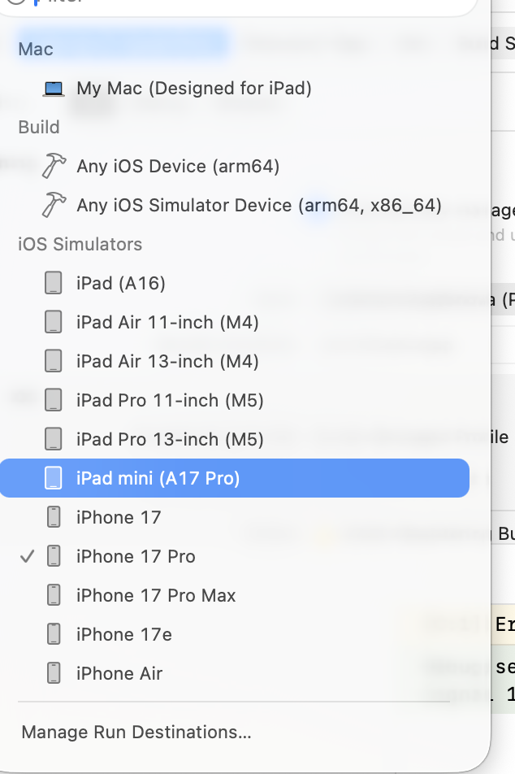


### Recommended Release settings (already in project)


| Setting                    | Value                     |
| -------------------------- | ------------------------- |
| `SWIFT_COMPILATION_MODE`   | wholemodule               |
| `VALIDATE_PRODUCT`         | YES                       |
| `DEBUG_INFORMATION_FORMAT` | dwarf-with-dsym           |
| `ENABLE_NS_ASSERTIONS`     | NO                        |
| `CODE_SIGN_STYLE`          | Automatic                 |
| `GENERATE_INFOPLIST_FILE`  | YES + merged `Info.plist` |


---


## Screenshot Plan Summary (device matrix)

Primary Connect uploads prefer **Physical iPhone** where available; **iPhone 17 Pro Simulator** fills Workout Player and Scan Card. Files live in `docs/screenshots/`.


| Slot | Device class | Size                     | Screen           | Primary upload | Source | Capture |
| ---- | ------------ | ------------------------ | ---------------- | -------------- | ------ | ------- |
| 1    | iPhone 6.7"  | 1290×2796                | Home branding    | `01-home.png` | `device-01-home.png` | Physical iPhone |
| 2    | iPhone 6.7"  | 1290×2796                | Exercise library | `02-exercises.png` | `device-02-exercises.png` | Physical iPhone |
| —    | (optional)   | —                        | Exercise detail  | — | `device-03-exercise-detail.png` | Physical iPhone |
| —    | (optional)   | —                        | Routines list    | `03-routines.png` | `sim-03-routines.png` | Simulator |
| 3    | iPhone 6.5"  | 1284×2778 (or 1242×2688) | Routine detail (Morning Strength) | `04-routine-detail.png` | `device-05-routine-detail.png` | Physical iPhone |
| —    | (optional / HIG) | —                    | Edit Exercise    | — | `device-04-edit-exercise.png` | Physical iPhone |
| 4    | iPhone 6.5"  | 1284×2778 (or 1242×2688) | Workout player   | `05-workout-player.png` | `sim-05-workout-player.png` | Simulator |
| 5    | iPhone 5.5"  | 1242×2208                | Card scanner     | `06-scan-card.png` | `sim-06-scan-card.png` | Simulator |
| 6    | iPhone 5.5"  | 1242×2208                | History / stats (Complete) | `07-history.png` | `device-06-history.png` | Physical iPhone |
| —    | Archive      | —                        | Superseded sim Home / Exercises / Routine / History | — | `sim-01-home.png`, `sim-02-exercises.png`, `sim-04-routine-detail.png`, `sim-07-history.png` | Simulator |
| —    | Privacy only | —                        | Photos picker (limited library) | — | `privacy-photos-picker.png` | Simulator |
| —    | Xcode only   | —                        | Run destination menu | — | `xcode-run-destination.png` | macOS |


For Connect size compliance, re-capture on size-matched simulators or devices if needed: **iPhone 16 Pro Max** (6.7"), **iPhone 11 Pro Max / 14 Plus** family (6.5"), **iPhone 8 Plus** (5.5"). Prefer physical-device recaptures for remaining Simulator-only primaries (Workout Player, Scan Card) when convenient.

---


## Mapping to Udacity `.docx` template fields

Paste the **Your Answers** column values from the tables above into:

Platforms · App Name · Primary Language · Bundle ID · SKU · User Access · Primary Category · Secondary Category · Screenshots 1–6 · Promotional Text · Description · Keywords · Support URL · Version · Sign in Required · Notes · Copyright · Data Collection · App Availability · Price · In-App Purchase · Subscriptions

A filled Word document is also generated at:

`docs/app-store-submission-document.docx`